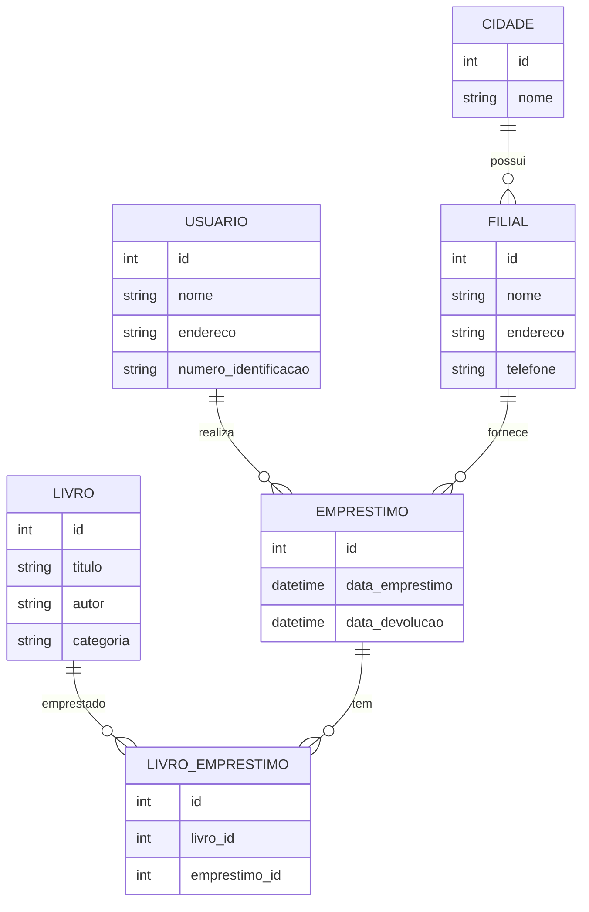

```mermaid
erDiagram
    CIDADE ||--o{ FILIAL : possui
    USUARIO ||--o{ EMPRESTIMO : realiza
    LIVRO ||--o{ LIVRO_EMPRESTIMO : emprestado
    FILIAL ||--o{ EMPRESTIMO : fornece
    EMPRESTIMO ||--o{ LIVRO_EMPRESTIMO : tem

    LIVRO {
        int id
        string titulo
        string autor
        string categoria
    }

    FILIAL {
        int id
        string nome
        string endereco
        string telefone
    }

    USUARIO {
        int id
        string nome
        string endereco
        string numero_identificacao
    }

    EMPRESTIMO {
        int id
        datetime data_emprestimo
        datetime data_devolucao
    }

    LIVRO_EMPRESTIMO {
        int id
        int livro_id
        int emprestimo_id
    }

    CIDADE {
        int id
        string nome
    }

```
