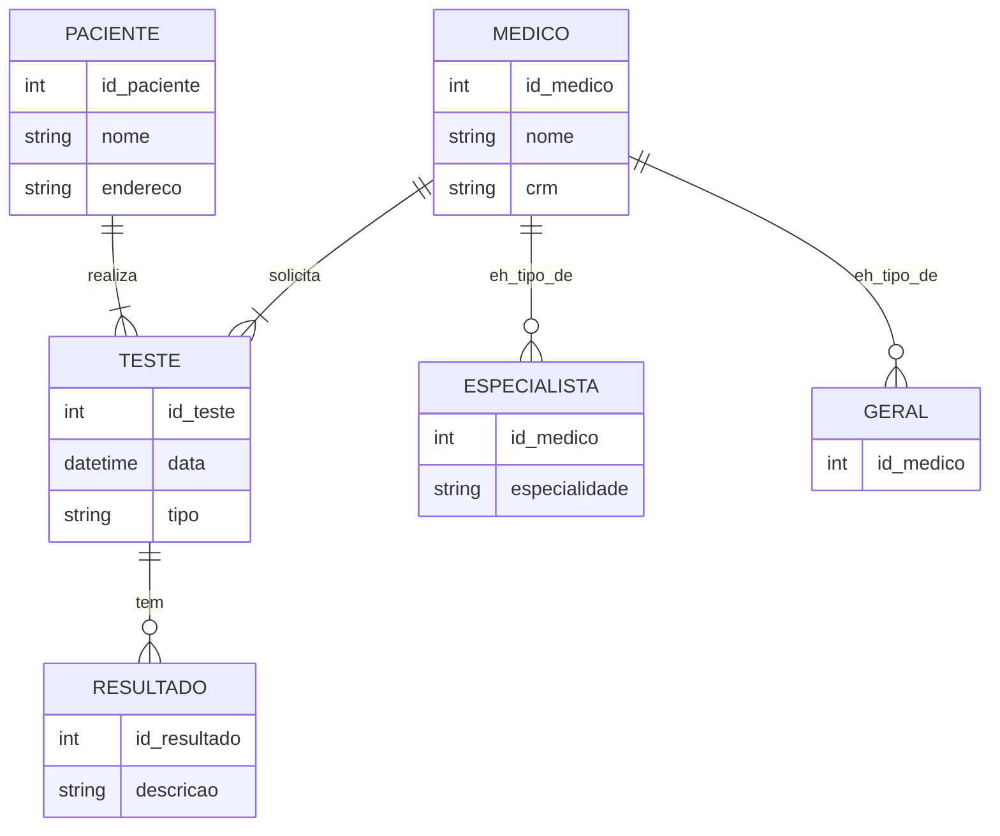

```mermaid
erDiagram
    PACIENTE ||--|{ TESTE : realiza
    MEDICO ||--|{ TESTE : solicita
    TESTE ||--o{ RESULTADO : tem
    MEDICO ||--o{ ESPECIALISTA : eh_tipo_de
    MEDICO ||--o{ GERAL : eh_tipo_de

    PACIENTE {
        int id_paciente
        string nome
        string endereco
    }

    MEDICO {
        int id_medico
        string nome
        string crm
    }

    ESPECIALISTA {
        int id_medico
        string especialidade
    }

    GERAL {
        int id_medico
    }

    TESTE {
        int id_teste
        datetime data
        string tipo
    }

    RESULTADO {
        int id_resultado
        string descricao
    }
```