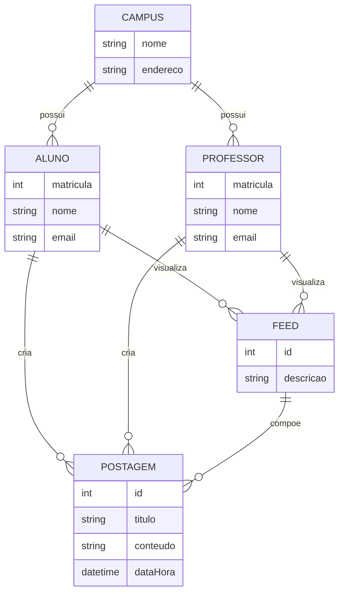

```mermaid
erDiagram
    CAMPUS ||--o{ ALUNO : possui
    CAMPUS ||--o{ PROFESSOR : possui
    ALUNO ||--o{ POSTAGEM : cria
    PROFESSOR ||--o{ POSTAGEM : cria
    ALUNO ||--o{ FEED : visualiza
    PROFESSOR ||--o{ FEED : visualiza
    FEED ||--o{ POSTAGEM : compoe

    CAMPUS {
        string nome
        string endereco
    }

    ALUNO {
        int matricula
        string nome
        string email
    }

    PROFESSOR {
        int matricula
        string nome
        string email
    }

    POSTAGEM {
        int id
        string titulo
        string conteudo
        datetime dataHora
    }

    FEED {
        int id
        string descricao
    }

```