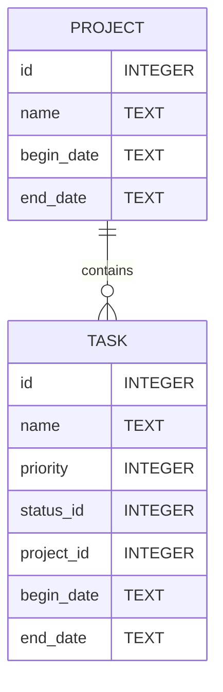
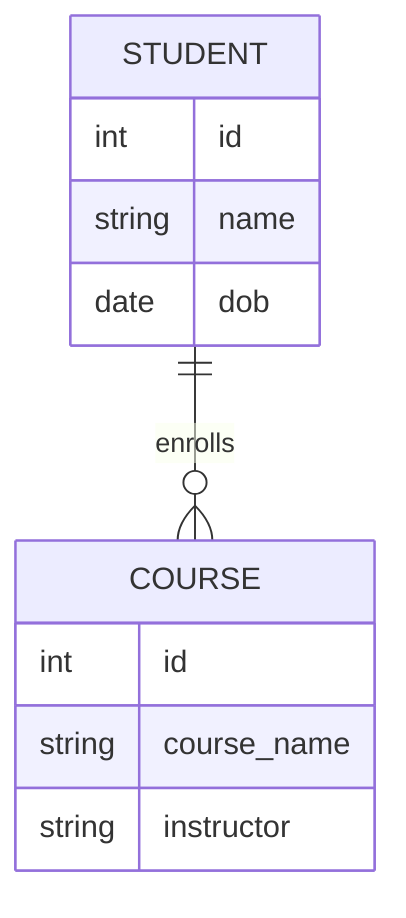

# Introdução ao PostgreSQL com Python

Olá, jovem desenvolvedor(a)! 🚀 Se você sempre quis mergulhar no mundo dos bancos de dados, está no lugar certo. Neste guia, vou te apresentar ao PostgreSQL e mostrar como interagir com ele usando Python. Vamos lá?

## O que é PostgreSQL?

PostgreSQL, carinhosamente chamado de Postgres, é um sistema de gerenciamento de banco de dados relacional (RDBMS) gratuito e de código aberto. É conhecido por sua robustez, extensibilidade e conformidade com padrões. Em palavras simples: é onde você pode armazenar, organizar e recuperar seus dados de forma eficiente!

## Por que usar PostgreSQL?

1. **Gratuito e de código aberto:** Você não precisa pagar nada para usá-lo.
2. **Extensível:** Você pode criar suas próprias funções, tipos de dados e mais.
3. **Conformidade com padrões:** Adere aos padrões SQL, garantindo que você aprenda SQL da maneira "certa".

## Como instalar o PostgreSQL?

1. **Windows:** [Baixe o instalador oficial](https://www.postgresql.org/download/windows/)
2. **Mac:** Use o Homebrew: `brew install postgresql`
3. **Linux:** Depende da sua distribuição, mas geralmente `sudo apt-get install postgresql` para sistemas baseados em Debian.

Após a instalação, você pode iniciar o Postgres com o comando `pg_ctl start`.

## Preparando o ambiente Python

Para interagir com o Postgres usando Python, precisamos de uma biblioteca chamada `psycopg2`. Instale-a com:

```bash
pip install psycopg2
```

## O código: `create_table.py`

### Pré-requisitos:

- Python instalado
- Biblioteca `psycopg2` instalada
- PostgreSQL instalado e em execução
- Um usuário do PostgreSQL com permissão para criar bancos de dados

### Diagrama ERD das Tabelas:



### 1. Importando as bibliotecas necessárias:
```python
import psycopg2
from psycopg2 import sql
```
Neste trecho, estamos importando a biblioteca `psycopg2`, que é um adaptador PostgreSQL para Python. Também estamos importando um módulo específico, `sql`, que nos ajuda a construir comandos SQL de forma segura.

### 2. Configuração de Conexão:
```python
DB_NAME = "tutorial_db"
USER = "postgres"
PASSWORD = ""
HOST = "localhost"
PORT = "5432"
```
Aqui, definimos algumas constantes que serão usadas para se conectar ao banco de dados PostgreSQL. Estas são informações básicas necessárias para estabelecer a conexão.

### 3. Função para conectar ao servidor Postgres:
```python
def conectar_servidor():
    return psycopg2.connect(
        dbname="postgres",
        user=USER,
        password=PASSWORD,
        host=HOST,
        port=PORT
    )
```
Esta função estabelece uma conexão com o servidor PostgreSQL. Estamos nos conectando especificamente ao banco de dados padrão "postgres", que sempre existe em qualquer instalação PostgreSQL.

### 4. Função para conectar ao nosso banco de dados:
```python
def conectar_db():
    return psycopg2.connect(
        dbname=DB_NAME,
        user=USER,
        password=PASSWORD,
        host=HOST,
        port=PORT
    )
```
Esta função é semelhante à anterior, mas aqui estamos nos conectando ao nosso banco de dados específico, definido pela constante `DB_NAME`.

### 5. Função para criar um novo banco de dados:
```python
def criar_db():
    conn = conectar_servidor()
    conn.autocommit = True
    cursor = conn.cursor()
    cursor.execute(sql.SQL("CREATE DATABASE {}").format(sql.Identifier(DB_NAME)))
    cursor.close()
    conn.close()
```
Nesta função, primeiro conectamos ao servidor PostgreSQL. Em seguida, habilitamos o `autocommit` para executar o comando de criação do banco de dados fora de uma transação (requisito do PostgreSQL). Usamos o `cursor` para executar comandos SQL. O comando específico aqui cria um novo banco de dados com o nome definido em `DB_NAME`.

### 6. Função para criar as tabelas:
```python
def criar_tabelas():
    # SQL para criar as tabelas
    sql_create_projects_table = "...";
    sql_create_tasks_table = "...";
    
    # Conectando e criando as tabelas
    with conectar_db() as conn:
        with conn.cursor() as cursor:
            cursor.execute(sql_create_projects_table)
            cursor.execute(sql_create_tasks_table)
```
Nesta função, definimos os comandos SQL para criar as tabelas `projects` e `tasks`. Depois, nos conectamos ao nosso banco de dados e executamos os comandos SQL para criar as tabelas.

### 7. Execução do script:
```python
if __name__ == "__main__":
    criar_db()
    criar_tabelas()
```
Esta é a parte final do script. O código sob o `if __name__ == "__main__":` é executado apenas quando o script é chamado diretamente (não quando é importado). Aqui, estamos chamando as funções para criar o banco de dados e depois criar as tabelas.

## 🚀 Atividade para você! 

Agora que você aprendeu o básico, sua missão é:

1. **Criar um novo banco de dados** chamado "school_db".
2. **Criar duas novas tabelas**: "students" e "courses".

### Diagrama ERD da Atividade:



# PGAdmin: A Ferramenta Gráfica para o PostgreSQL


Depois de falar sobre o PostgreSQL, é impossível não mencionar o **pgAdmin**. Ele é a ferramenta de administração e gestão mais popular para o PostgreSQL, e o melhor de tudo: é gratuita e de código aberto!

## O que é o pgAdmin?

O **pgAdmin** é uma plataforma de administração e gestão para o PostgreSQL. Ela permite que você interaja com seu banco de dados de forma visual, facilitando tarefas como:

- Criar e modificar tabelas
- Visualizar dados em tabelas
- Executar consultas SQL
- Gerenciar permissões e usuários
- E muito mais!

Tudo isso através de uma interface amigável e intuitiva.

## Por que usar o pgAdmin?

1. **Interface Gráfica:** Para quem não está acostumado com a linha de comando, o pgAdmin oferece uma maneira fácil e visual de gerenciar bancos de dados.
2. **Multiplataforma:** Funciona em Windows, Mac e Linux.
3. **Poderoso:** Apesar de ser visual, o pgAdmin é extremamente poderoso e pode lidar com praticamente qualquer tarefa relacionada ao PostgreSQL.
4. **Desenvolvimento de Consultas:** Possui um editor SQL integrado para você testar suas consultas.

## Como instalar o pgAdmin?

1. **Windows:** [Baixe o instalador oficial](https://www.pgadmin.org/download/pgadmin-4-windows/)
2. **Mac:** Use o Homebrew: `brew install pgadmin4`
3. **Linux:** Depende da sua distribuição, mas geralmente `sudo apt-get install pgadmin4` para sistemas baseados em Debian.

## Primeiros passos com o pgAdmin:

1. **Inicie o pgAdmin** após a instalação.
2. **Conecte-se ao seu servidor PostgreSQL:** Na primeira vez que você executar o pgAdmin, ele pedirá que você se conecte a um servidor PostgreSQL. Use as credenciais do seu servidor local (geralmente "localhost" com seu nome de usuário e senha).
3. **Navegue pelo painel lateral:** Você verá seus bancos de dados, esquemas, tabelas e outros objetos.
4. **Crie e execute consultas:** Use o editor SQL para criar e testar suas consultas.

Agora, com o **pgAdmin** à sua disposição, você tem uma ferramenta poderosa para gerenciar e visualizar seus bancos de dados. Recomendo que brinque um pouco com ele para se familiarizar e descobrir todas as suas funcionalidades incríveis! 🌟
