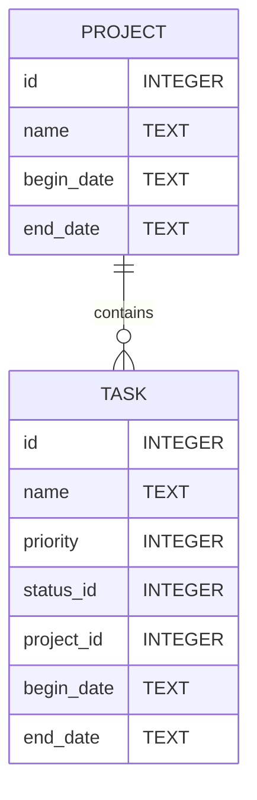
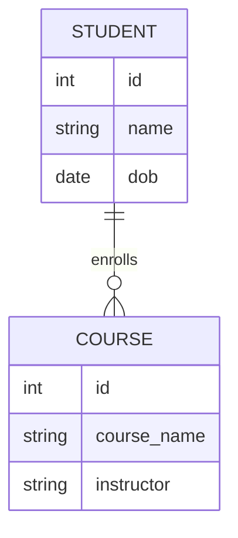

# O código: `create_table.py`

## Pré-requisitos:

- Python instalado
- Biblioteca `psycopg2` instalada
- PostgreSQL instalado e em execução
- Um usuário do PostgreSQL com permissão para criar bancos de dados

## Diagrama ERD das Tabelas:



## 1. Importando as bibliotecas necessárias:
```python
import psycopg2
from psycopg2 import sql
```
Neste trecho, estamos importando a biblioteca `psycopg2`, que é um adaptador PostgreSQL para Python. Também estamos importando um módulo específico, `sql`, que nos ajuda a construir comandos SQL de forma segura.

## 2. Configuração de Conexão:
```python
DB_NAME = "tutorial_db"
USER = "postgres"
PASSWORD = ""
HOST = "localhost"
PORT = "5432"
```
Aqui, definimos algumas constantes que serão usadas para se conectar ao banco de dados PostgreSQL. Estas são informações básicas necessárias para estabelecer a conexão.

## 3. Função para conectar ao servidor Postgres:
```python
def conectar_servidor():
    return psycopg2.connect(
        dbname="postgres",
        user=USER,
        password=PASSWORD,
        host=HOST,
        port=PORT
    )
```
Esta função estabelece uma conexão com o servidor PostgreSQL. Estamos nos conectando especificamente ao banco de dados padrão "postgres", que sempre existe em qualquer instalação PostgreSQL.

## 4. Função para conectar ao nosso banco de dados:
```python
def conectar_db():
    return psycopg2.connect(
        dbname=DB_NAME,
        user=USER,
        password=PASSWORD,
        host=HOST,
        port=PORT
    )
```
Esta função é semelhante à anterior, mas aqui estamos nos conectando ao nosso banco de dados específico, definido pela constante `DB_NAME`.

## 5. Função para criar um novo banco de dados:
```python
def criar_db():
    conn = conectar_servidor()
    conn.autocommit = True
    cursor = conn.cursor()
    cursor.execute(sql.SQL("CREATE DATABASE {}").format(sql.Identifier(DB_NAME)))
    cursor.close()
    conn.close()
```
Nesta função, primeiro conectamos ao servidor PostgreSQL. Em seguida, habilitamos o `autocommit` para executar o comando de criação do banco de dados fora de uma transação (requisito do PostgreSQL). Usamos o `cursor` para executar comandos SQL. O comando específico aqui cria um novo banco de dados com o nome definido em `DB_NAME`.

## 6. Função para criar as tabelas:
```python
def criar_tabelas():
    # SQL para criar as tabelas
    sql_create_projects_table = "...";
    sql_create_tasks_table = "...";
    
    # Conectando e criando as tabelas
    with conectar_db() as conn:
        with conn.cursor() as cursor:
            cursor.execute(sql_create_projects_table)
            cursor.execute(sql_create_tasks_table)
```
Nesta função, definimos os comandos SQL para criar as tabelas `projects` e `tasks`. Depois, nos conectamos ao nosso banco de dados e executamos os comandos SQL para criar as tabelas.

## 7. Execução do script:
```python
if __name__ == "__main__":
    criar_db()
    criar_tabelas()
```
Esta é a parte final do script. O código sob o `if __name__ == "__main__":` é executado apenas quando o script é chamado diretamente (não quando é importado). Aqui, estamos chamando as funções para criar o banco de dados e depois criar as tabelas.

# 🚀 Atividade para você! 

Agora que você aprendeu o básico, sua missão é:

1. **Criar um novo banco de dados** chamado "school_db".
2. **Criar duas novas tabelas**: "students" e "courses".

## Diagrama ERD da Atividade:

